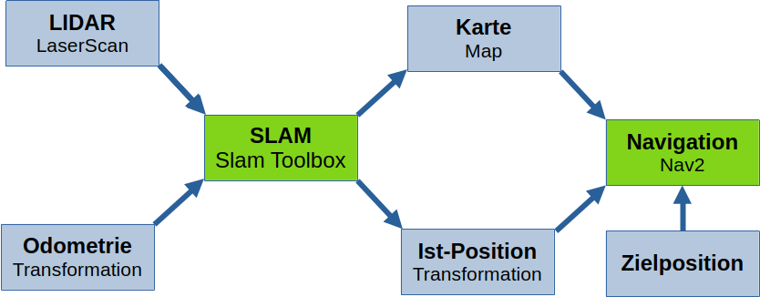
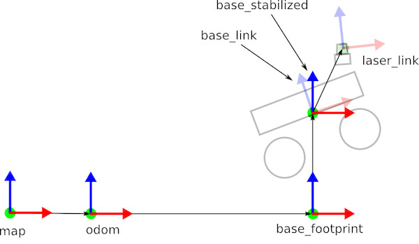
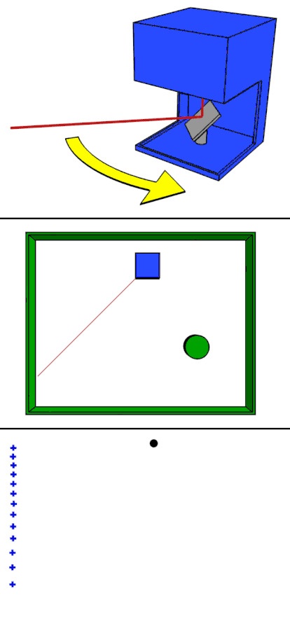
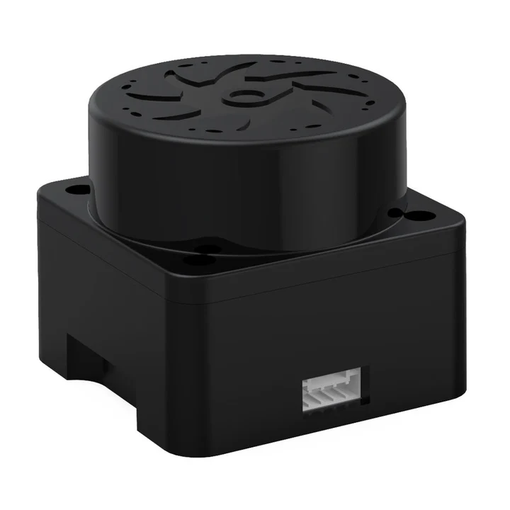

# Workshop Lokalisierung und Navigation
am 17.01.2024 im Leonardo Zentrum Nürnberg

### **Inhaltsverzeichnis**  

0. [Grundlagen](#grundlagen)  
   0.1 [Standard Workflow für die Navigation mit ROS2](#standard-workflow-für-die-navigation-mit-ros2)  
   0.2 [Transformationen in ROS](#transformationen-in-ros)  
   0.3 [Visualisierung](#visualisierung)  

1. [Lidar Sensor](#1-lidar-sensor)  
   1.1 [YDLidar Mini Pro](#11-ydlidar-mini-pro)  
      1.1.1 [YDLidar SDK installieren](#111-ydlidar-sdk-installieren)  
      1.1.2 [YDLidar ROS Wrapper installieren](#112-ydlidar-ros-wrapper-installieren)  
      1.1.3 [YDLidar konfigurieren](#113-ydlidar-konfigurieren)  
      1.1.4 [YDLidar Knoten starten](#114-ydlidar-knoten-starten)  
   1.2 [LDrobot LD19](#12-ldrobot-ld19)  
      1.2.1 [LDrobot Lidar Knoten installieren](#121-ldrobot-lidar-knoten-installieren)  
      1.2.2 [LDrobot Lidar konfigurieren](#122-ldrobot-lidar-konfigurieren)  
      1.2.3 [LDrobot Lidar Knoten starten](#123-ldrobot-lidar-knoten-starten)  

2. [Odometrie](#2-odometrie)  
   2.1 [Laser Scan Matcher](#21-laser-scan-matcher)  
      2.1.1 [Scan Matching Bibliothek installieren](#211-scan-matching-bibliothek-installieren)  
      2.1.2 [Laser Scan Matcher installieren](#212-laser-scan-matcher-installieren)  
      2.1.3 [Laser Scan Matcher parametrieren](#213-laser-scan-matcher-parametrieren)  
      2.1.4 [Laser Scan Matcher starten](#214-laser-scan-matcher-starten)  

3. [Lokalisierung mit der SLAM Toolbox](#3-lokalisierung-mit-der-slam-toolbox)  
   3.1 [SLAM Toolbox installieren](#31-slam-toolbox-installieren)  
   3.2 [SLAM Toolbox konfigurieren](#32-slam-toolbox-konfigurieren)  
   3.3 [SLAM Toolbox starten](#33-slam-toolbox-starten)  

4. [Navigation mit Nav2](#4-navigation-mit-nav2)  
   4.1 [Nav2 installieren](#41-nav2-installieren)  
   4.2 [Nav2 konfigurieren](#42-nav2-konfigurieren)  
   4.3 [Nav2 starten](#43-nav2-starten)  
   4.4 [Nav2 über Rviz bedienen](#44-nav2-über-rviz-bedienen)  
   4.5 [Nav2 mit ROS-Knoten ansteuern](#45-nav2-mit-ros-knoten-ansteuern)  

5. [Tipps und Tricks](#5-tipps-und-tricks)  
   5.1 [Daten auf den Roboter kopieren](#51-daten-auf-den-roboter-kopieren)  
   5.2 [Git-Repositories lokal klonen und kopieren](#52-git-repositories-lokal-klonen-und-kopieren)  

<br>
<br>


# Grundlagen

## Standard Workflow für die Navigation mit Ros2




## Transformationen in Ros
Transformationen sind eine Möglichkeit, um die Position und Orientierung von Objekten in einem anderen Koordinatensystem anzugeben.
Das kann z.B. die Position des Roboters im Welt-Koordinatensystem sein oder die Position eines Sensors auf dem Roboter.
Den "TF Tree" kann man mit folgendem Kommando anzeigen.

```
ros2 run rqt_tf_tree rqt_tf_tree
```



## Visualisierung
Um alles grafisch anzuzeigen kann man das Ros Standardwerkzeug `Rviz` (Ros1) bzw. `Rviz2` (Ros2) benutzen.


# 1. Lidar Sensor

Für die Lokalisierung verwenden wir einen Lidar Sensor.
Nachfolgend ist die Installation von zwei Einsteigermodellen beschrieben.
Es können auch andere Modelle verwendet werden, wichtig ist dass am Ende ein `LaserScan` in Ros publiziert wird.



[Quelle](https://de.m.wikipedia.org/wiki/Datei:LIDAR-scanned-SICK-LMS-animation.gif)

## 1.1 YDLidar Mini Pro



[Quelle](https://www.elektor.de/cdn/shop/files/ydlidar-tmini-pro-360-degree-laser-range-scanner-12-m20514-563775.jpg?v=1718725984)
### 1.1.1 YDLidar SDK installieren
- https://github.com/YDLIDAR/YDLidar-SDK

```
mkdir ~/ydlidar_ws
cd ydlidar_ws
git clone https://github.com/YDLIDAR/YDLidar-SDK.git -b V1.2.7
mkdir YDLidar-SDK/build -p
cd YDLidar-SDK/build

cmake ..
cmake --build .
sudo cmake --install .
```

Lidar testen:
```
tri_test
```
-> Baudrate: **240400**
-> one-way: **yes**
-> **Str + c** zum beenden

### 1.1.2 YDLidar Ros Wrapper installieren
- Ros1: https://github.com/YDLIDAR/ydlidar_ros_driver
- Ros2: https://github.com/YDLIDAR/ydlidar_ros2_driver

```
mkdir ~/ros2_ws/src -p
cd ~/ros2_ws/src
git clone https://github.com/YDLIDAR/ydlidar_ros2_driver.git -b humble
cd ../
colcon build --packages-select ydlidar_ros2_driver --symlink-install
source install/setup.bash
```

### 1.1.3 YDLidar konfigurieren
- Die Launchdatei `ydlidar_launch.py` lädt eine Konfigurationsdatei.
- Die Konfigurationsdateien sind im `ydlidar_ros2_driver/params` Verzeichnis.
- Standardmäßig wird `ydlidar.yaml`geladen
- Launchdatei `ydlidar_launch.py` öffnen `ydlidar.yaml` durch `TminiPro.yaml` ersetzten
-  `static_transform_publisher` definiert die Position des Sensors auf dem Roboter und sollte auf die tatsächliche Position angepasst werden.
	  -> Empfehlung: Vorhandenen Code durch den folgenden ersetzen:
```	  
# base_link to laser_frame
tf2_node = Node(
	package='tf2_ros',
	executable='static_transform_publisher',
	name='base_link_to_base_tof',
	arguments=["--x", "0.0","--y", "0.0","--z", "0.0","--roll", "0.0","--pitch", "0.0","--yaw", "0.0", "--frame-id", "base_link","--child-frame-id", "laser_frame"],
	output="screen"
)
```
- `x`, `y`, `z` sind in Metern definiert. `roll`, `pitch`,  `yaw` sind in Radiant definiert.

### 1.1.4 YDLidar Knoten starten

Lidar Knoten auf Roboter starten
```
ros2 launch ydlidar_ros2_driver ydlidar_launch.py
```

Visualisierung auf lokalem Rechner öffnen
```
rviz
```
-> Add -> By topic -> /scan/LaserScan


## 1.2. LDrobot LD19

### 1.2.1 LDrobot Lidar Knoten installieren
- Ros1: https://github.com/ldrobotSensorTeam/ldlidar_stl_ros
- Ros2: https://github.com/ldrobotSensorTeam/ldlidar_stl_ros2

```
mkdir ~/ros2_ws/src -p
cd ~/ros2_ws/src
git clone https://github.com/ldrobotSensorTeam/ldlidar_stl_ros2.git
cd ../
colcon build --packages-select ldlidar_stl_ros2 --symlink-install
source install/setup.bash
```

**Aktuell gibt es einen kleinen Fehler in dem Paket: https://github.com/ldrobotSensorTeam/ldlidar_stl_ros2/pull/25 .**

### 1.2.2 LDrobot Lidar konfigurieren
- Launchdatei `ld19.launch.py` öffnen
- `static_transform_publisher` analog zum obigen Lidar bearbeiten.
  **Achtung: Die Transformation heißt hier `base_laser` statt `laser_frame`**

### 1.2.3 LDrobot Lidar Knoten starten

Lidar Knoten auf Roboter starten
```
ros2 launch src/ldlidar_stl_ros2/launch/ld19.launch.py
```

Visualisierung auf lokalem Rechner öffnen
```
rviz
```
-> Add -> By topic -> /scan/LaserScan

# 2. Odometrie

**Odometrie** [...] bezeichnet eine Methode der Schätzung von Position und Orientierung eines mobilen Systems anhand der Daten seines Vortriebsystems. [ ](https://de.wikipedia.org/wiki/Odometrie)

Odometrie kann u.a. auf Grundlage folgender Messwerten berechnet werden:
- Radumdrehungen aus Motorencoder
- Beschleunigungs- und Drehraten aus IMU
- Scan-Matching der Lidar Messwerte

Wir verwenden Scan-Matching, da man hier neben dem Lidar keinen zusätzlichen Sensor benötigt.
Es kann sich lohnen andere Quellen für die Odometrie auszuprobieren, da nicht alle Quellen in allen Szenarios gleich gut funktionieren.

## 2.1 Laser Scan Matcher

### 2.1.1 Scan Matching Bibliothek installieren
- https://github.com/AlexKaravaev/csm

```
mkdir ~/csm_ws
cd csm_ws
git clone https://github.com/AlexKaravaev/csm.git
mkdir csm/build -p
cd csm/build

cmake ..
cmake --build .
sudo cmake --install .
```


### 2.1.2 Laser Scan Matcher installieren
- Ros 1: https://github.com/CCNYRoboticsLab/scan_tools
- Ros2: https://github.com/AlexKaravaev/ros2_laser_scan_matcher

```
mkdir ~/ros2_ws/src -p
cd ~/ros2_ws/src
git clone https://github.com/AlexKaravaev/ros2_laser_scan_matcher
cd ../
colcon build --packages-select ros2_laser_scan_matcher --symlink-install
source install/setup.bash
```

**Achtung: Auch hier gibt es wieder einen kleinen Fehler, der behoben werden muss: https://github.com/AlexKaravaev/ros2_laser_scan_matcher/issues/16

Ggf. müssen noch einige Bibliotheken installiert werden:
```
sudo apt-get install ros-jazzy-tf2
sudo apt-get install ros-jazzy-tf2-geometry-msgs
sudo apt-get install libboost-all-dev
```

### 2.1.3 Laser Scan Matcher parametrieren

Leider gibt es kein fertiges Launchfile.

### 2.1.4 Laser Scan Matcher starten

```
ros2 run ros2_laser_scan_matcher laser_scan_matcher
```


___

# 3. Lokalisierung mit der Slam toolbox

## 3.1.1 Slam Toolbox installieren
```
mkdir ~/ros2_ws/src -p
cd ~/ros2_ws/src
git clone -b jazzy https://github.com/SteveMacenski/slam_toolbox.git
cd ../
colcon build --packages-select slam_toolbox --symlink-install
source install/setup.bash
```

Abhängigkeiten installieren:
```
rosdep install -q -y -r --from-paths src --ignore-src
```


____
# 4. Navigation mit Nav2

## 4.1. Nav2 installieren
https://docs.nav2.org/getting_started/index.html

```
sudo apt install ros-jazzy-navigation2
sudo apt install ros-jazzy-nav2-bringup
```

## 4.2. Nav2 konfigurieren

- Parameterdatei herunterladen (dabei auf richtige Ros Version achten):
  https://github.com/ros-navigation/navigation2/blob/jazzy/nav2_bringup/params/nav2_params.yaml
  
- Parameter auf eigenen Roboter anpassen ([Beschreibung der Parameter](https://docs.nav2.org/configuration/packages/configuring-mppic.html)). Wichtige Parameter:
	- motion_model
	- required_movement_radius
	- robot_radius
	- inflation_radius
	- max_velocity, min_velocity
	- max_accel, min_decel
	-  alle frame_id's

- Allgemeine Bescheibung der Nav2 Parameter: https://docs.nav2.org/configuration/index.html#

## 4.3 Nav2 starten 

```
ros2 launch nav2_bringup navigation_launch.py params_file:=/home/pi/nav2_ws/nav2_params.yaml
```

## 4.4 Nav2 über Rviz bedienen

- Rviz öffnen
- Wichtige Topics einblenden
- Mit "2D Pose Estimate" die ungefähre Roboterposition angeben
- Mit "2D Goal Pose" Navigationsziele vorgeben
- Bei EduArt Antriebselektronik nach Zielvorgabe noch den "enable" Service aufrufen

## 4.5 Nav2 mit Ros Knoten ansteuern
- https://docs.nav2.org/commander_api/index.html


____
# 5. Tipps und Tricks

**Daten auf Roboter kopieren:**
1) Linux File Explorer -> "Other Locations"
2) Mit Remote-Rechner verbinden 
```
sftp://<user>@<remote-ip>/
```
z.B. `sftp://pi@192.168.0.100/`


**Git lokal clonen und kopieren**
1) In das tmp Verzeichnis des lokalen Rechners wechseln
```
cd /tmp
```

2) Ein Git Repository lokal clonen und anschließend auf den Roboter kopieren.
```
git clone https://github.com/YDLIDAR/YDLidar-SDK.git -b V1.2.7
scp -r YDLidar-SDK pi@192.168.0.100:/home/pi/ydlidar_ws/ydlidar_ws/
```

```
git clone https://github.com/YDLIDAR/ydlidar_ros2_driver.git -b humble
scp -r ydlidar_ros2_driver pi@192.168.0.100:/home/pi/ros2_ws/src/
```

```
git clone https://github.com/ldrobotSensorTeam/ldlidar_stl_ros2.git
scp -r ldlidar_stl_ros2 pi@192.168.0.100:/home/pi/ros2_ws/src/
```

```
git clone https://github.com/AlexKaravaev/csm.git
scp -r csm pi@192.168.0.100:/home/pi/csm_ws
```

```
git clone -b jazzy https://github.com/SteveMacenski/slam_toolbox.git
scp -r slam_toolbox pi@192.168.0.100:/home/pi/ros2_ws/src
```

```
git clone https://github.com/AlexKaravaev/ros2_laser_scan_matcher
scp -r ros2_laser_scan_matcher pi@192.168.0.100:/home/pi/ros2_ws/src
```